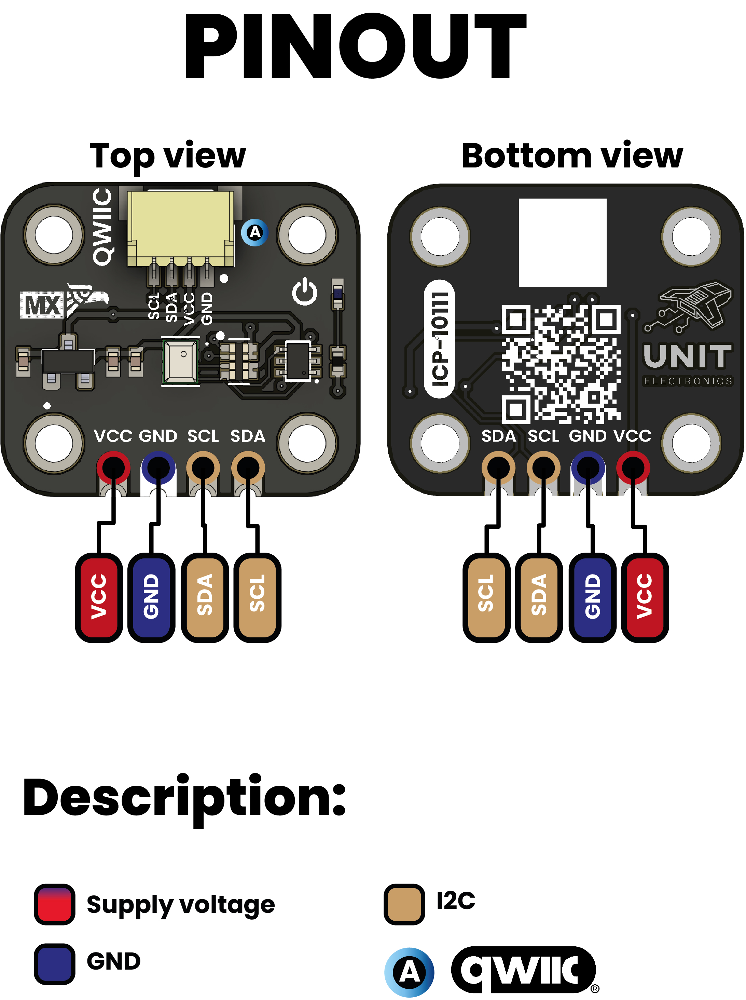

# Electronic Module Template

## Product Overview

This electronic module serves as a professional template for hardware documentation and development. It provides a standardized framework for electronic module specification, complete with professional documentation, software integration examples, and development tools.

**Key Applications:**
- IoT sensor systems
- Embedded electronics projects
- Industrial automation
- Educational development platforms
- Prototype development
- Professional product development

### Key Features

- **Standardized Design** - Professional electronic module template following industry standards
- **Multi-Interface Support** - I2C, SPI, and GPIO connectivity options
- **Low Power Design** - Optimized for battery-powered applications
- **Modular Architecture** - Flexible integration with existing systems
- **Compact Form Factor** - Standard module dimensions for easy integration
- **Wide Operating Range** - Industrial temperature and voltage ranges
- **Professional Documentation** - IEEE/ISO compliant technical documentation

## Technical Specifications

### Electrical Performance

| Parameter | Specification | Unit | Test Conditions |
|-----------|---------------|------|-----------------|
| **Supply Voltage** | 3.0 - 5.5 | V | Operating range |
| **Operating Current** | 10 - 100 | mA | Typical operation |
| **Standby Current** | 1 - 10 | µA | Sleep mode |
| **Logic Levels** | 3.3V/5V | V | CMOS compatible |
| **Operating Temperature** | -40 to +85 | °C | Industrial range |
| **Storage Temperature** | -55 to +125 | °C | Non-operating |

### Interface Specifications

| Interface | Specification | Notes |
|-----------|---------------|-------|
| **Primary Interface** | I2C | Standard mode, 100-400 kHz |
| **Secondary Interface** | SPI | Optional, up to 10 MHz |
| **GPIO Pins** | 4 | Configurable I/O |
| **Interrupt Output** | Active low | Open-drain |

### Physical Characteristics

| Parameter | Min | Typ | Max | Unit | Conditions |
|-----------|-----|-----|-----|------|------------|
| **Supply Voltage** | 2.7 | 3.3 | 5.5 | V | Wide input range |
| **Active Current** | 0.8 | 1.2 | 2.0 | mA | Continuous measurement |
| **Standby Current** | - | 0.1 | 0.5 | µA | Sleep mode |
| **Internal LDO Output** | 1.71 | 1.8 | 1.89 | V | ICP-10111 core supply |
| **I2C Clock Frequency** | - | 100/400 | 1000 | kHz | Standard/Fast/Fast+ modes |

## Pinout Configuration

### Primary I2C Interface

| Pin | Label | Function | Electrical | Notes |
|-----|-------|----------|------------|-------|
| 1 | **VCC** | Power Supply | 2.7-5.5V | Wide voltage input |
| 2 | **GND** | Ground | 0V | Digital and analog ground |
| 3 | **SDA** | I2C Data | 3.3V logic | Open-drain with 4.7kΩ pull-up |
| 4 | **SCL** | I2C Clock | 3.3V logic | Open-drain with 4.7kΩ pull-up |

### QWIIC Connector (J1)

| Pin | Color | Function | Voltage |
|-----|-------|----------|---------|
| 1 | Black | GND | 0V |
| 2 | Red | 3.3V | 3.3V ±5% |
| 3 | Blue | SDA | 3.3V logic |
| 4 | Yellow | SCL | 3.3V logic |

### Additional Test Points

| Label | Function | Access |
|-------|----------|--------|
| TP1 | 1.8V LDO Monitor | Test point |
| TP2 | BME688 Enable | Optional control |
| LED1 | Power Indicator | Green LED |

## Physical Dimensions

### PCB Specifications

| Parameter | Dimension | Tolerance | Notes |
|-----------|-----------|-----------|-------|
| **Length** | 25.4 mm | ±0.1 mm | Standard 1-inch module |
| **Width** | 15.2 mm | ±0.1 mm | Compact profile |
| **Thickness** | 1.6 mm | ±0.1 mm | Standard PCB |
| **Mounting** | Castellated | - | Edge plating for SMD mounting |
| **Weight** | 2.5 g | ±0.2 g | Typical assembled weight |

### Environmental Operating Conditions

| Parameter | Minimum | Maximum | Unit | Notes |
|-----------|---------|---------|------|-------|
| **Operating Temperature** | -40 | +85 | °C | Extended industrial range |
| **Storage Temperature** | -55 | +125 | °C | Non-operating storage |
| **Relative Humidity** | 0 | 95 | %RH | Non-condensing |
| **Atmospheric Pressure** | 300 | 1250 | hPa | Sensor measurement range |

## Communication Interface
| **Weight** | ~2.1 g | - | Including components |

### Component Heights

| Component | Height | Location |
|-----------|--------|----------|
| ICP-10111 | 1.0 mm | Top side, center |
| BME688 | 0.95 mm | Top side, left |
| QWIIC Connector | 3.5 mm | Top side, edge |
| Castellated Holes | 0.1 mm | Edge plating |

## Block Diagram

### System Architecture

The module implements a dual-sensor architecture:

1. **Primary Sensor Path (ICP-10111)**:
   - Direct I2C communication at address 0x63
   - Internal 1.8V LDO for sensor core
   - 20-bit pressure ADC with temperature compensation

2. **Secondary Sensor Path (BME688)**:
   - Independent I2C communication at address 0x77  
   - Environmental monitoring (T/H/Gas)
   - Shared 3.3V supply with power management

3. **Interface and Power**:
   - Single I2C bus with individual device addressing
   - Integrated pull-up resistors (4.7kΩ)
   - Power-on LED indicator
   - ESD protection on all I/O pins

## Component Reference

### Primary Components

| Reference | Part Number | Description | Manufacturer | Notes |
|-----------|-------------|-------------|--------------|-------|
| **IC1** | ICP-10111 | Barometric Pressure Sensor | TDK InvenSense | Primary sensor |
| **IC2** | BME688 | Environmental Sensor | Bosch Sensortec | T/H/Gas optional |
| **U1** | ME6206A18XG | 1.8V LDO Regulator | Microne Semi | 250mA output |
| **U2** | TXS0102 | Level Shifter | Texas Instruments | 3.3V/1.8V translation |

### Passive Components

| Reference | Value | Package | Function |
|-----------|-------|---------|----------|
| **R1, R2** | 4.7kΩ | 0402 | I2C pull-up resistors |
| **R3** | 1kΩ | 0402 | LED current limiting |
| **C1** | 10µF | 0603 | Power supply decoupling |
| **C2, C3** | 100nF | 0402 | High-frequency bypass |
| **C4** | 1µF | 0402 | LDO output filtering |

### Connectors and Indicators

| Reference | Description | Specifications |
|-----------|-------------|----------------|
| **J1** | QWIIC Connector | JST GH 1.25mm, 4-pin |
| **JP1** | Castellated Holes | 2.54mm pitch, 4 positions |
| **LED1** | Power Indicator | Green, 0603 package |

## Communication Interface

### I2C Bus Configuration

| Parameter | Value | Unit | Notes |
|-----------|-------|------|-------|
| **Bus Voltage** | 3.3 | V | Logic level |
| **Pull-up Resistance** | 4.7 | kΩ | Integrated on PCB |
| **Clock Frequencies** | 100/400/1000 | kHz | Standard/Fast/Fast+ |
| **Maximum Bus Capacitance** | 400 | pF | Per I2C specification |

### Device Addresses

| Device | 7-bit Address | 8-bit Address | Function |
|--------|---------------|---------------|----------|
| **ICP-10111** | 0x63 | 0xC6/0xC7 | Pressure/Temperature |
| **BME688** | 0x77 | 0xEE/0xEF | Environmental sensing |

*Note: 8-bit addresses shown as Write/Read format*

### Communication Protocol

**ICP-10111 Register Access:**
- Read operations: Single or burst read supported
- Measurement triggering: Command-based or continuous
- Data format: 20-bit pressure + 16-bit temperature
- Conversion time: 1.6ms (normal mode)

**BME688 Register Access:**
- Standard Bosch Sensortec protocol
- Multiple operating modes available
- Gas sensor heater control
- FIFO buffer for data logging
